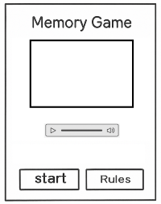
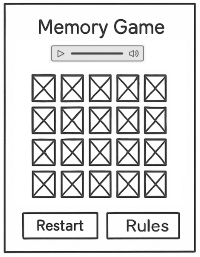
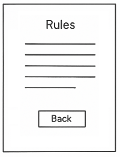
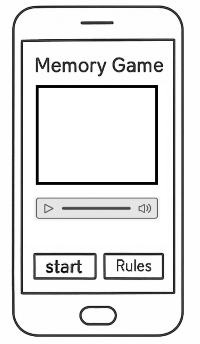
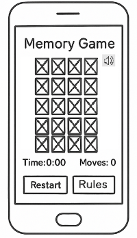
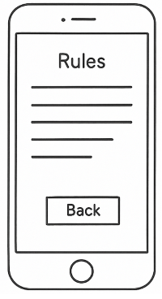
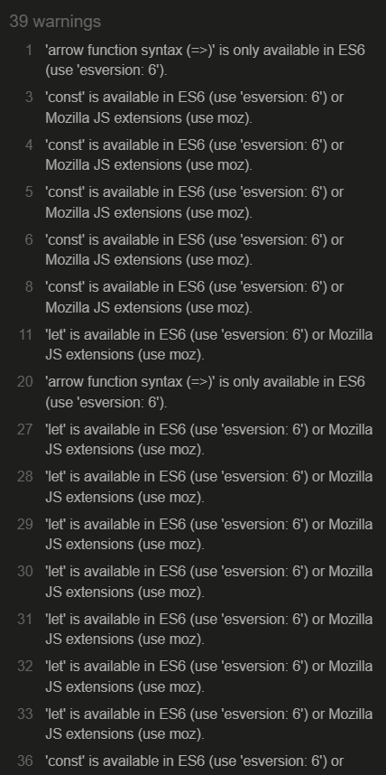
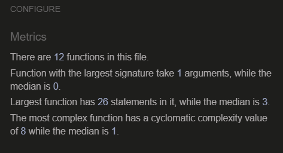
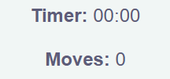

# Match the Farm's Furry Friends!

 


## Table of content
* [Introduction](#introduction)
* [User experience](#user-experience)
* [Design](#design)
* [Features](#features)
* [Technologies Used](#technologies-used)
* [Testing](#testing)
* [Deployment](#deployment)
* [Credits](#credits)

## Introduction
**Match the Farm's Furry Friends** is a memory card game made for a single player. The game is primarily aimed at children, but adults can also enjoy this light-hearted game. The theme of the game is Old McDonald's farm, and behind each card is one of his furry friends. To spice up your memory, each animal makes a sound when the card is being flipped.
## User experience
### User story

As a first-time visitor,
* I want to understand how to play the game.
* I want to easily navigate on the website.
* I want to be able to restart the game.
* I want a visually appealing design that makes me want to play the game.

As a returning visitor,
* I want to quickly start a new game without any hassle.
* I want something more than just a plane memory card game.
* I want some sort of tracking of my results, to want to play again and to beat my previous result.

As a parent of a minor playing the game,
 * I want the game to be appropriate for children to play.
* I want to be able to mute the game, so that my child can play without disturbing others. 
* I want the game to be enjoyable for my child.
  

## Design


### Wireframes
Wireframes on the layout of the website was created in Paint.

* For laptops,

  

* For mobile phones

  

### Fonts and color theme
The fonts that was chosen were Lato and Roboto. In case they would not load, sans-serif was the backup.


The color palette was created by [Colorpicker](https://imagecolorpicker.com/en), using the image on the homepage. From the image a ten-color palette was created. 
 
 
 
 From the palette, only five colors were chosen as the color theme. 
 
 


1.  #9e1816;
2.  #3f6f48;
3.  #bba667;
4.  #ebf7f5;
5.   #5c5c7c;

 ### Images
 All images are downloaded from [Freepik](https://www.freepik.com/).  The images were selected to bring a cohesive appearance to the website. When choosing the images, it was also taken into account that mainly children would play the game.

 The same autor, [@brgfx](https://www.freepik.com/author/brgfx) made all of the images. 

 
 
 To match the theme of Old McDonald's Farm, a chicken was chosen as the [Favicon](https://favicon.io/).

[Photopea](https://www.photopea.com/) was used to change the propotions of the card images. Aswell as making all images smaller to suit the website.

### Audio
To make the website more inviting, a clip of the song *Old McDonald had a Farm* was added to an audioplayer on the homepage. The song as well as the animal sounds were downloaded from [Pixabay](https://pixabay.com/). 

The animal soundeffects were from different editors,

* Cat [SOUND_GARAGE](https://pixabay.com/users/sound_garage-47313534/)
* Chick [ajangrahmat](https://pixabay.com/users/ajangrahmat-19214935/)
* Cow [RibhavAgrawal](https://pixabay.com/users/ribhavagrawal-39286533/).
* Dog [freesound_community](https://pixabay.com/users/freesound_community-46691455/)
* Duck [freesound_community](https://pixabay.com/users/freesound_community-46691455/)
* Goat [SoundsForYou
](https://pixabay.com/users/soundsforyou-4861230/)
* Horse [TanwerAman](https://pixabay.com/users/tanweraman-29554143/)
* Pig [freesound_community](https://pixabay.com/users/freesound_community-46691455/)
* Rooster [RibhavAgrawal](https://pixabay.com/users/ribhavagrawal-39286533/).
* Sheep [Teoglas](https://pixabay.com/users/teoglas-43857789/)

The audioclips were cut and faded-out by [Chatgpt](https://chatgpt.com/).

## Features

* Classic memory card match *– Flip cards to find and match all pairs.*

* Farm animal theme *– Each card features a farm animal.*

* Animal sounds *– Play a matching animal sound when a card is flipped.*

* Sound toggle *– Option to mute animal sounds during the game.*

* Timer *– Track how long it takes to complete the game.*

* Move counter *– Keep count of how many moves the player makes.*

* End game detector  *– Detects when all pairs are matched and stops the timer.*

* Restart game button *– Reset the board and start a new round.*

* Responsive layout *– Works well on different screen sizes.*

* Audio player on start page *– Lets users play a farm-themed  song.*

* Rules page *– Dedicated section explaining how the game works.*

*  404 page *– A page with a “lost sheep” for broken links.*

### Future features
Some ideas about how to expand the game in the future,

* Scoreboard *– So players can see their best times and their personal records (or their friends’).*
* Invite friends *– A way to challenge your friends.*
* Choose number of cards *– Let players pick how many cards they want to play with, to create different levels of difficulty and keep the game challenging.*


## Technologies Used
### Languages
*  HTML
*  CSS
* JavaScript

### Frameworks & Tools
* [Am I responsive?](https://ui.dev/amiresponsive) 
* [Bootstrap v5.3](https://getbootstrap.com/)
* [Colorpicker](https://imagecolorpicker.com/)
* [ChatGPT](https://chatgpt.com/)
* [Favicon.io](https://favicon.io/)
* [Font Awesome](https://fontawesome.com/)
* [Freepik](https://www.freepik.com/)
* [Git](https://git-scm.com/)
* [GitHub](https://github.com/)
* [Google Fonts](https://fonts.google.com/)
* [Paint](https://jspaint.app/#local:8360383649047)
* [Photopea](https://www.photopea.com/)
* [Pixabay](https://pixabay.com/)
* [VS Code](https://code.visualstudio.com/)


## Testing
### Validation
* [HTML Validator](https://validator.w3.org/) has been used to test all tree html files. No errors were found before submission.

   

* [CSS Validation Service](https://jigsaw.w3.org/css-validator/) was used to test the CSS style sheet and no errors were found.

   

* Lighthouse testing show good results for speed, accessibility, and SEO. 

   ***index.html***

   

   ***game.html***

   

   ***rules.html***

   

* [JS Hint](https://jshint.com/) gave the result of 39 warnings.

   

   I added /* jshint esversion: 6 */ to the top of the Javascript file, and the warnings dissapeared. Instead I was left with the following,

   
 
### Responsiveness
The website has been evaluated across multiple devices including smartphones, tablets, and laptops. It adapts well to all tested screen sizes. Similarly, it performs consistently across various browsers like Chrome, Microsoft Edge, and Safari.

### User stories
Each user story was tested as follows:

| As a first time visitor,   | Steps |  |Result|
| ------------- | ------|----------------- | -----|
|I want to understand how to play the game.| On the home page as well as on the game page, there is a button that will navigate the player to the rules page. On the rules page there is simple instructions on ***How to Play*** the game. |        | Achieved
| I want to easily navigate on the website.| On the bottom of each page there are buttons that will navigate the player to either the game-, rules- or the homepage.|     | Achieved     |
|I want to be able to restart the game.   | On the game page, there is a ***Restart Game*** button that can be clicked anytime during the game.  |      | Achieved
| I want a visually appealing design that makes me want to play the game. | The theme, colors and images has carefully been choosen to make the game attractive. |  | Achieved

|As a returning visitor, | Steps | | Result |
| -------- | ------- |--------- |---|
 I want something more than just a plane memory card game. | The theme song on the home page as well as the sound effects while playing the game, adds some interest to the game.  |     | Achieved |
| I want to quickly start a new game without any hassle.| When going on the website, the player is able to start the game in just one click. |  | Achieved |
| I want some sort of tracking of my results, to want to play again and to beat my previous result. | When starting the game, a timer and a move counter sets off. When the player finishes the game, they can easily take note of their result.  |    | Achieved |
|

|As a parent of a minor playing the game, | Steps |  | Result |
| -------- | ------- |---------|--|
| I want the game to be appropriate for children to play.  | The game is very easy to play. It contains child-friendly animal pictures and each animal card plays a sound when turned over.| |  Achieved
| I want to be able to mute the game, so that my child can play without disturbing others.  | The audio player on the website needs to be turned on manually for the music to play. The sound effects in the game can easily be muted by a sound toggler.| | Achieved |
| I want the game to be enjoyable for my child.|The fact that each card plays a sound when turned over gives the game a fun and interactive dimension. Using colorful and child-friendly images will also add to enjoyment.|  |Achieved
| 


### Manual testing
* All buttons, the timer and the move counter have been manually tested to ensure correct functionality.

* The game has been verified for browser compatibility in Chrome, Safari, and Microsoft Edge.

* Mobile responsiveness has been evaluated using both browser developer tools and real devices.

### Bugs
The following error appeared in the console.


With help from [ChatGPT](https://chatgpt.com/) the error dissapeared by itself when opening up the browser in Incognito mode.

Another bug that appeared in the console gave the following message,

```
script.js:156 Uncaught TypeError: Cannot read properties of null (reading 'addEventListener')
 at HTMLDocument.<anonymous> (script.js:156:14)
```

This bug was desolved by removing the Javascript link from both index- and rules.html.

### Unfixed bugs
All identified bugs were resolved before submission.

## Deployment

### Version Control
The website was created using VS Code, and pushed to GitHub to the remote repository. The following git commands were used,
* **Git add .** *-Adds a change in the working directory to the staging area.*
* **Git commit -m "message"** *-Commits changes to the local repository.*
* **Git push** *-Uploads the commited changes to the remote repository in Github.*


### Deployment to GitHub Pages
1. Go to the **Settings** tab of your GitHub repo.
2. On the left-hand sidebar, in the Code and automation section, select **Pages**.
3. Make sure:
   * Source is set to 'Deploy from Branch'.
   * Main branch is selected.
   * Folder is set to / (root).
4. Under Branch, click **Save**.
5. Go back to the Code tab. Wait a few minutes for the build to finish and refresh your repo.
6. On the right-hand side, in the Environments section, click on **'github-pages'**.
7. Click **View deployment** to see the live site.

The link to the live website: [Match the Farm's Furry Friends](https://emelie-nilsson.github.io/MilstoneProject2/index.html)

### How to clone the repository
1. From the list of repositories, click the repository you want to clone. 
2. Click the green button **Code**.
3. Choose **HTTPS** followed by **Open with GitHub Desktop**.
4. Click **Choose** and navigate to a local directory where you want to clone the repository.
5. Click **Clone**

### How to fork the repository
1. From the list of repositories, click the repository you want to fork.
2. Click on the **Fork** button in upper right hand corner.

## Credits
### Code
My code is inspired by various lessons and modules in Code Institute's LMS (Learning Management System) and [Codecademy](https://www.codecademy.com/).


My code is also inspired by different [YouTube](https://www.youtube.com/) videos,

* [JavaScript Academy](https://www.youtube.com/watch?v=xWdkt6KSirw&list=LL&index=7&t=195s)
* [NerdyCodeCrafter](https://www.youtube.com/watch?v=QJWnbJ39nP4&list=LL&index=6)
* [London School of Emerging Technology](https://www.youtube.com/watch?v=DxKYpwgIWG0&list=LL&index=5)
* [Kenny Yip Coding](https://www.youtube.com/watch?v=wz9jeI9M9hI&list=LL&index=4)


Other web development learning resources,

* [W3 Schools](https://www.w3schools.com/)
* [Stack Overflow](https://stackoverflow.com/questions)

### Content
The instructions under [Deployment](#deployment) were taken from the module *Love running -Essentials Project* and [GitHub Docs](https://docs.github.com/en/desktop/adding-and-cloning-repositories/cloning-a-repository-from-github-to-github-desktop).  

The rest of the content was written by the developer.

### Acknowledgements
I would like to express my sincere gratitude to my mentor, Spencer Barribal, for stepping in with valuable support and guidance during the final stages of this project. 

A special thanks also goes to ChatGPT – for keeping me company during countless coding sessions, patiently debugging both my code and my sanity, and always returning helpful answers, even at the most unreasonable hours.

Without you two, this project might still be stuck in an infinite loop.
